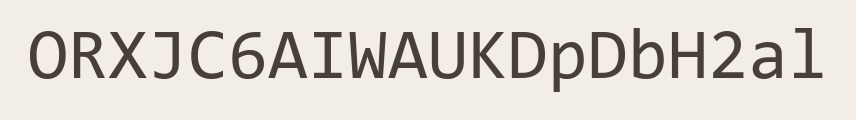

# VOICEROID2-YMM

[YMM4 (ゆっくり Movie Maker v4)](https://manjubox.net/ymm4/) 向けの VOICEROID2 音声合成プラグインです。
YMM4 上では声質のエンジン名・設定名として **VOICEROID2** と表示されます。

**64bit 専用**: YMM4 (64bit) のプロセス内で VOICEROID2 の音声エンジン (`aitalked.dll`) を直接
ロードするため、64bit 版の VOICEROID2 が必要です。

## セットアップ

1. `VOICEROID2-YMM.dll` を YMM4 の `user\plugin\VOICEROID2-YMM\` フォルダに配置する。
2. 認証シードをシステム環境変数 `VOICEROID2_AUTH_SEED` に設定する (値は下記の画像を参照)。

   

3. YMM4 を再起動する。

シード値はコード・設定ファイルには含まれておらず、環境変数でのみ指定します。

## 環境変数

| 変数 | 用途 | 既定 |
|------|------|------|
| `VOICEROID2_AUTH_SEED` | 認証コードのシード値 (必須) | なし (未設定なら合成時にエラー) |
| `VOICEROID2_YMM_INSTALL_DIR` | VOICEROID2 インストール先の上書き | Program Files / レジストリから自動検出 |
| `VOICEROID2_YMM_USER_DIR` | VOICEROID2 ユーザーデータ (辞書) の基準ディレクトリ | `%USERPROFILE%\Documents\VOICEROID2` |

## 使い方 (YMM4)

1. タイムラインに「音声合成」アイテムを追加し、キャラクターの声質に `VOICEROID2` を選ぶ。
2. 初回は声質一覧が VOICEROID2 の `Voice` フォルダのスキャンで取得されキャッシュされる
   (設定画面の「声質一覧を更新」で再取得できる)。
3. 音声パラメータで、話速、ピッチ、抑揚、音量、ポーズ (文間) を調整できる。
4. 合成時、`Documents\VOICEROID2` のユーザー辞書 (単語 / フレーズ / 記号ポーズ) が存在すれば
   自動で読み込まれる。

### アクセントの指定 (ゆっくり記法)

ゆっくりボイス (AquesTalk) と同様に、**モーラの直後に「'」(アポストロフィ)** を置くと
そのモーラからピッチが下がります。

| 入力 | 意味 |
|------|------|
| `ハ'シ` | は**し** (橋: ハで下がる) |
| `ハシ'` | はし (箸: シで下がる) |
| `ゆっ'くりしていってね` | ゆっ**く**り… (既定は ゆ にアクセント) |

- セリフ欄に「'」を書けば反映されます。細かく調整したい場合はアクセントエディタ
  (下記) を使うのがおすすめです。
- 読みは AITalk の読み記号 (AI-Kana) を介して変換されるため、かなのモーラ数が
  ずれる場合はアクセント指定が無視されて既定の読みで合成されます。

### YMM4 の辞書 (読み上げ変換) について

このプラグインは YMM4 の**読み上げ変換のユーザー辞書**を直接読み込み、セリフへの
テキスト置換として適用します。YMM4 の設定で登録した内容がそのまま合成に反映されます
(辞書が見つからない・壊れている場合は辞書なしで動作します)。

- **読み上げ変換**: 表記の置換 (例: ゆっくりMovieMaker → ゆっくりムービーメーカー、時刻 → 〇時〇分)
- **伏せ字**: 不適切な単語を伏せ字にして読み上げる
- 正規表現・大文字小文字無視・有効/無効は YMM4 側の設定に従います

### アクセントエディタ

音声アイテムのプロパティにある「VOICEROID2 発音編集 (アクセント)...」ボタンから、
アクセント位置をグラフィカルに編集できるウィンドウが開きます。

- 単語 (アクセント句) ごとに、カタカナのモーラと VOICEPEAK 風の高低ラインが表示される
  (区切りは VOICEROID2 と同じアクセント句境界です。例: 弦巻マキです → ツルマキ と マキデス の 2 句)
- **モーラをクリック**すると、そのモーラからピッチが下がる位置にアクセント核が移動する
  (同じモーラをもう一度クリックすると指定を解除してエンジン既定へ)
- **モーラを上下にドラッグ**でもアクセント位置を変更できる (上へドラッグ = そのモーラまで高、
  下へドラッグ = そのモーラから低。最後のモーラを上へ = 句内に下がりなし = エンジン既定)
- 下がり位置には **▼ マーカー**が表示される。▼ を**左右にドラッグ**するとアクセント核がモーラ境界
  に沿って移動し、**クリックで解除** (エンジン既定へ)。解除中はエンジン既定の位置に破線の ▼ が
  表示され、クリックでその位置に確定できる
- 各モーラの下に「高」「低」ラベルが表示される
- 区切りは **ポーズ (P マーク)** と **無音のアクセント句境界 (空白)** を区別して表示される
  (例: こんにちは、弦巻マキです → コンニチワ [P] ツルマキ マキデス)
- ヘッダー帯の**「句分割」**ボタンで、アクセント核の位置に**無音の句境界**を入れて
  アクセント句を 2 つに分割できる (ポーズは挿入しない。句ごとに独立したアクセント核を持てる)
- **単語の読み (ヘッダー帯) をクリック**すると読み編集欄が開き、よみがなを直接変更できる
  (かな・漢字どちらでも可。Enter で確定、Esc でキャンセル)。確定するとエンジンが読みを
  再取得してモーラ列とアクセントを再構成する (読みが変わったためアクセント位置はエンジン
  既定に戻る。編集欄に「'」を書けばアクセント位置も同時に指定できる)
- **「プレビュー再生」**で実際の合成と同じ読みを試聴できる (OK 後の発音と一致します)
- **「OK (適用)」**で反映、キャンセルで破棄。反映後はその読みが合成に使われる

### 設定画面

`設定 > VOICEROID2` に以下を表示します:

- 接続: 検出されたインストール先 / ユーザーデータ / 認証シードの設定状態 (値自体は表示しない)
- 声質一覧の更新ボタン
- 読み仮名辞書エディタ (表記 → 読みの置換テーブル。合成時にテキストへ適用)

## 制限

- 64bit 版 VOICEROID2 専用。32bit 版しかない環境では合成時に明確なエラーを表示します。
- 声質の表示名は VoiceDB ディレクトリ名です (既知のコード `akari_44` → 紲星あかり、`tamiyasu_44` → 民安ともえ は変換されます)。

## ライセンス

このリポジトリのコードは [LICENSE](LICENSE) (BSD 2-Clause) に従います。
音声エンジンの呼び出し方法の参考として [aitalk_wrapper](https://github.com/rumia/aitalk_wrapper)
(MIT)、プラグイン構造・GUI デザインの参考として VoicePeak-plus (MIT 相当) を使用しています。
